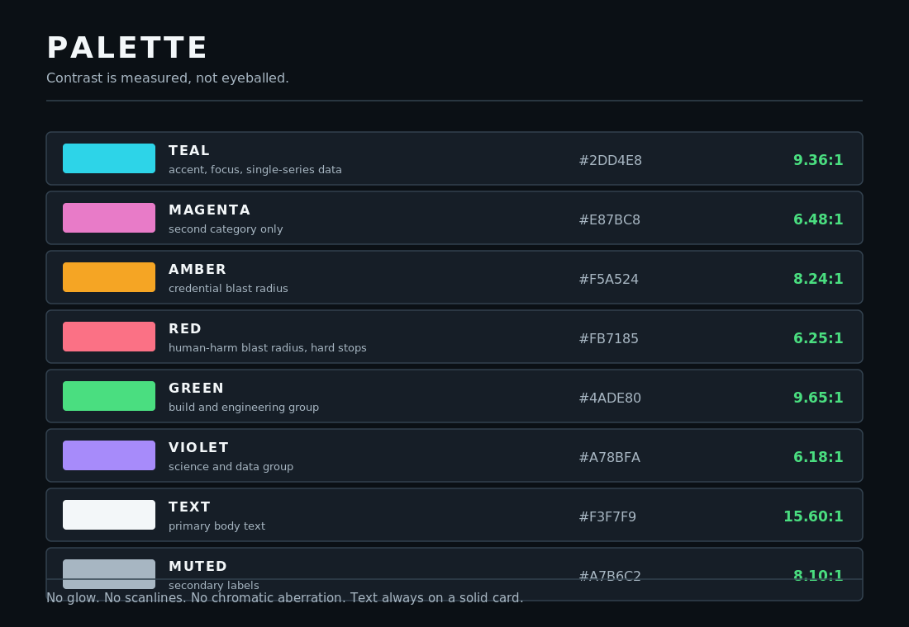

# Palette

**Asset:** `palette-contrast.svg`  
**Canvas:** 1100 x 760  
**Vector:** 9 KB  |  **PNG export:** 59 KB  
**Group:** branding

## What it shows

The full palette with measured WCAG 2.2 contrast ratios against the card surface.

## Design decisions

- Contrast is computed from the hex values, never eyeballed.
- No glow, no scanlines, no chromatic aberration - a seizure hazard, and they destroy the solid edges that contrast measurement assumes.
- Text always sits on a solid card, so its contrast is provable rather than situational.

## Accessibility

| Property | Value |
| :--- | :--- |
| Solid background | Yes, never transparent |
| Minimum type size | 13px |
| Maximum type size | 36px |
| Blur or glow filters | None |
| Emoji | None |
| `role`, `title`, `desc` | Present |
