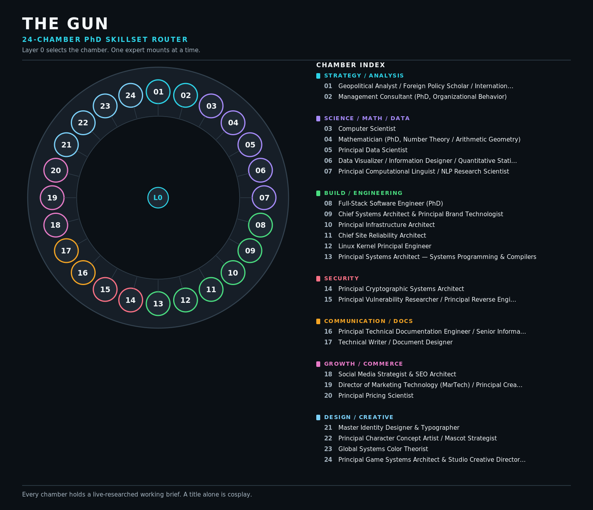

# The Gun

**Asset:** `24-chamber-revolver.svg`  
**Canvas:** 1500 x 1290  
**Vector:** 26 KB  |  **PNG export:** 245 KB  
**Group:** diagrams

## What it shows

The hero asset. All 24 expert chambers arranged as a revolver cylinder, colour-coded by discipline group, with every chamber named in an index beside it.

## Design decisions

- The centre pin is Layer 0 - the permanent router identity that never swaps.
- Chamber colour encodes DISCIPLINE GROUP, which is a real category, not decoration.
- The index sits inside the image. A diagram whose labels live only in a caption fails a low-vision reader.

## Defect found while building it

Legend overflowed the canvas by 148px on first generation, silently cutting the entire design/creative group while still looking finished. Caught by comparing text coordinates against the viewBox, then fixed and guarded so it cannot ship again.

## Accessibility

| Property | Value |
| :--- | :--- |
| Solid background | Yes, never transparent |
| Minimum type size | 14px |
| Maximum type size | 40px |
| Blur or glow filters | None |
| Emoji | None |
| `role`, `title`, `desc` | Present |
