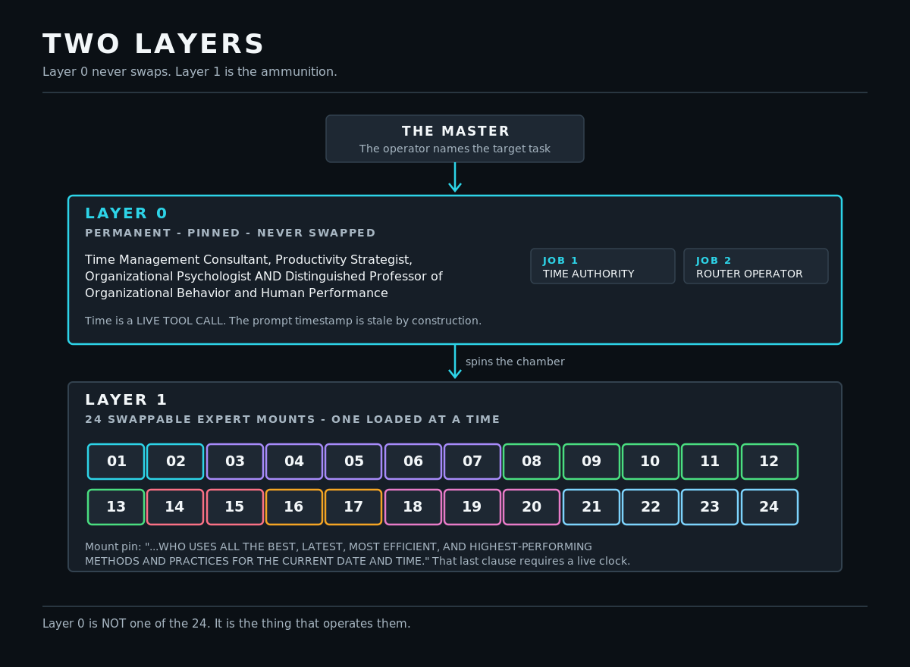
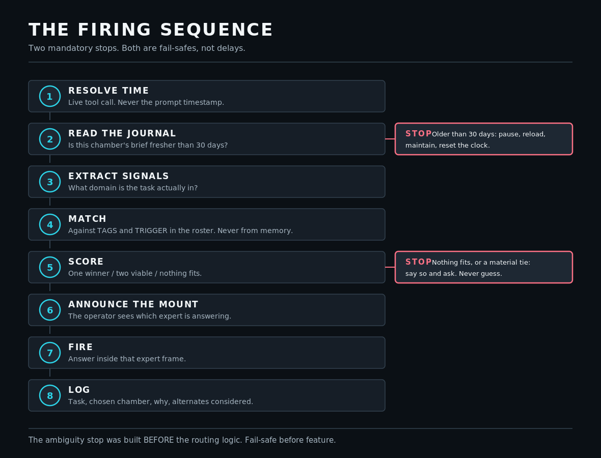
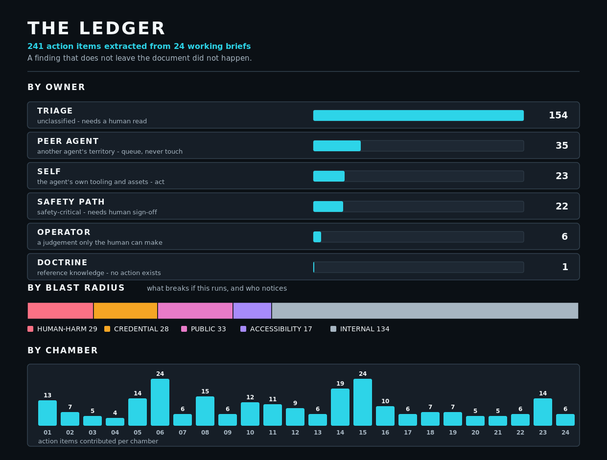

# ARCHITECTURE

How a routing system decides which kind of expert to be, before it answers.

---

## THE PROBLEM

An agent that claims twenty-four specialities has none of them. Asked about
cryptography it produces text shaped like cryptography; asked about colour theory
it produces text shaped like colour theory. Both read fluently. Neither is
grounded in what the discipline currently believes.

The failure is not that the answer is wrong. The failure is that **nothing in the
output signals which mode produced it**, so a confident answer from the wrong
frame is indistinguishable from a correct one.

This architecture makes the mode selection explicit, mechanical, and logged.

---

## TWO LAYERS

### Layer 0 — permanent, pinned, never swapped

A single identity that is always loaded and never exchanged for another. It has
exactly two jobs.

**Job 1: time authority.** Resolve the true current date and time through a live
call, every time it matters.

**Job 2: router operator.** Decide which expert the task needs, mount it,
announce it, unmount it when finished.

Layer 0 is **not one of the twenty-four**. It is the thing that operates them.
Confusing the router with the management-consultant chamber is the most likely
mis-mount in the whole system, which is why the roster carries an explicit note
against that entry.

### Layer 1 — twenty-four swappable mounts

One loads at a time. There is no blended-expert mode, because a blend has no
identifiable frame and therefore cannot be audited.

---

## WHY TIME IS FIRST, NOT INCIDENTAL

A language model's context is assembled once per turn. Any timestamp inside it is
written once and then goes stale for the remainder of the interaction. Every claim
built on it — *latest*, *current*, *today*, *this week* — silently inherits that
staleness.

So time is resolved by a **live call**, with a local timezone-aware fallback when
the primary is unavailable. The forbidden option is reading the timestamp out of
the context and treating it as now.

This is not pedantry. The mount pin ends with the words **"for the current date
and time."** That clause is a lie unless the clock was actually read. The pin is
what makes time resolution non-optional.

A related rule: **date arithmetic is executed, never reasoned about.** Deltas,
durations and expiry checks run as code. Models are unreliable at date maths in a
way that is very hard to notice, because the wrong answer is well-formed.

> Worth naming what this is *not*. An NTP daemon synchronises a machine clock. It
> does nothing for an agent that reads a stale string out of its own context. The
> problem is at a different layer than it first appears.

---

## THE FIRING SEQUENCE

| Step | Action |
| ---: | :--- |
| 1 | Resolve live time |
| 2 | Read the journal — is this chamber's brief fresh? |
| 3 | Extract the task's domain signals |
| 4 | Match against the roster's tags and triggers |
| 5 | Score the candidates |
| 6 | Announce the mount |
| 7 | Answer inside that expert frame |
| 8 | Log the decision and the alternates considered |

### Scoring has three outcomes, and one of them is a stop

| Outcome | Action |
| :--- | :--- |
| One clear winner | Mount it, name it, proceed |
| Two genuinely fit | Mount the primary, **name the secondary out loud**, proceed |
| Nothing fits, or a tie that changes the answer | **Stop. Say so. Ask.** |

The ambiguity stop was built **before** the routing logic it protects. That
ordering was deliberate: a router without a stop will always produce an answer,
and a confidently wrong expert frame is the most expensive failure the system can
produce. Fail-safe before feature.

Every decision is appended to a log — task, chosen chamber, reasoning, alternates
considered — so that a correction can be stored and the router can measurably
improve instead of repeating a mis-mount.

---

## WHAT MAKES A BRIEF LOAD-BEARING

A job title is free. The researched brief is the capability. An automated
conformance gate decides whether a brief counts, checking for:

| Requirement | Why |
| :--- | :--- |
| A machine-identifiable document type | So tooling can find it |
| The exact mount pin | Proves the framing was applied |
| A parsed research date | Anchors the freshness clock |
| A maintenance-due date | Research date plus thirty days |
| Roster tags and trigger | Keeps brief and router in sync |
| Real source URLs | Live research, not recall |
| A prioritised checklist | Findings must be actionable |
| A closing behavioural note | What changes in *conduct*, not just knowledge |

A chamber is recorded as loaded **only if its brief passes**. A file merely
existing never counts — that distinction is the entire difference between a
journal and a directory listing.

### The gate was wrong before the briefs were

Seven times the checker reported a problem and the checker was the problem:

| Reported | Actual cause |
| :--- | :--- |
| Almost no action items | Counted list bullets only; table-formatted checklists read as zero |
| Over a hundred emoji in one brief | Box-drawing characters in an ASCII diagram |
| Ninety-three emoji in another | A directory tree |
| A missing mount pin | The pin line wrapped, and the pattern normalised neither wrapping nor quote markers |
| One brief had five items | Its citation column contained the word "Step", which the header-detection pattern matched, so real rows were discarded as headers |
| Another had twelve items | It has four. Nested sub-bullets were counted as separate items |
| #06 had twenty-eight items | It has twenty-four. Its header read `\| Rank \| Requirement \| ...`, matching none of the header keywords, so four header rows counted as items **and** the parser filed the Consequence column as the action |

All six are now permanent regression cases. The standing rule they encode:
**when a probe reports something broad and alarming, suspect the probe first.**
Broad simultaneous failure is usually instrumentation.

---

## THE THIRTY-DAY RULE

Fresh inside thirty days means aim and fire. Older means pause, run an
upgrade-and-enhancement pass that adds new layers — current tools, methods and
practice as of the real present date — reload the chamber, and reset the clock.

Dates live in **both** the brief header and the journal. The brief is the source
of truth; the journal is derived and regenerable. If they disagree, regenerate the
journal — never hand-edit it to agree.

The refresh mechanism was deliberately built **last**. Six parser defects surfaced
while writing the briefs, and a maintenance system designed before those were
known would have inherited every one of them.

---

## THE LEDGER

Twenty-four briefs produced 241 concrete action items. Left as prose inside
twenty-four documents, they would have quietly evaporated — the same class of
failure as a safety switch that never reached the backup copies of the file it
was meant to guard.

**A finding that does not leave the document did not happen.**

So every item is extracted into a machine-readable index, assigned an owner, and
rated by blast radius.

### Ownership matters more than count

| Owner | Meaning |
| :--- | :--- |
| **SELF** | The agent's own tooling and assets. Act. |
| **PEER AGENT** | Another agent's territory. Queue it, never touch it. |
| **SAFETY PATH** | Safety-critical. Needs human sign-off. |
| **OPERATOR** | A judgement only the human can make. |
| **DOCTRINE** | Reference knowledge. No action exists. |
| **TRIAGE** | Classification failed. Needs a human read. |

Classification is **deliberately conservative**. An unmatched item lands in
TRIAGE rather than being guessed into a bucket, because a misfiled item aimed at
another system is worse than an unfiled one. Roughly two thirds currently sit in
TRIAGE, and that number is reported honestly rather than massaged down by
loosening the rules until it looks better.

### Blast radius, not severity, sets priority

Before filing any remediation, establish what **breaks if the remediation runs**.

A hardcoded credential in a repository nobody reads is a hygiene item. Rotating
that same credential when it is the only path to the operator's phone is an
outage. Same defect, opposite urgency — and the asymmetry is invisible from
reading the source alone.

There is a name for the specific trap: **cascading observability outage**, where
revoking a shared credential destroys the system's own ability to report that it
is broken.

---

## THE POINT

The goal is not an agent that sounds right. It is one that knows the difference
between knowing and guessing, and says which is which out loud.

Every mechanism here exists to make that difference structural rather than
aspirational. Time is resolved, not remembered. Titles are read, not recalled.
Briefs are gated, not assumed. Findings are extracted, not left in prose. And
when the right chamber is genuinely unclear, the system stops and says so instead
of firing anyway.
